# Supercon 2023: The Vectorscope Badge

# Overview

## The Badge

- What is It?

- How Does it Work?

- Can I Hack It?

## Inspiration: Analog

{height=500px}

## One Badge, Two Parts

- Vectorscope: 30 kHz "scope"

- Signal Generator: Driven by code 

- X/Y outputs, X/Y inputs (0 V - 3 V)

## Vectorscope

- Fake phosphor display 

- "No User-Serviceable Parts Inside"

- AK4619 Codec chip (`codec.py`)

- ADC in, 16 frames of 1024 samples (16-bit X/Y)

- Insane DMA/PIO Machine (`pixel_pusher.py`)

- Twelve lines of user-space code (`vectorscope.phosphor()`)

## Signal Generator

- DAC out

- Limitations: 30 kHz, ringy filter, one CPU core

- X/Y buffers, 256 points @ 16 bits, interleaved and pushed out

- This is your playground (`waveform.py`)

## Signal Generator "API"

- `v.wave.point(x,y)`  

- `v.wave.packX(list)`, `v.wave.packY(list)`

- `v.wave.outBuffer_ready`: 

- write False, wait till True

## Operating System

- Vectoros!

- Runs menu system

- Buttons and LEDs

- Uses `asyncio`: define functions `async` and be sure to yield

- Lets you map your code to `A/B/C/D.py`

## Micropython

- Why Micropython?

- Interactive REPL to control vectorscope is awesome

- Two cores: one just for you

- Filesystem

- Secret trick: Hold down the [User] Button on boot

## Creature Comforts

- Thonny IDE: configure to use badge, done

- mpremote: for the CLI aficionado

- `mp run file.py`, `mp cp *.py :`, `mp mount .`

- `picotool save -a your_image.uf2`

- VS Code stubs

## Many Ways to Play

- Use `vectorscope.wave`, funny graphics and/or sounds

- Go analog!

- Tweak vectorscope 

- Don't use vectorscope: GC9A01_mpy library compiled in

- Blow Micropython away and start from scratch (but: codec, screen, keys)

# Under the Hood

## Credits

- Hackaday Team: Elliot and Al and Tom

- Voja Antonic

- Design Lab: Giovanni, Majenta, Bruce, Keno, and Team 

## Tales of Woe 

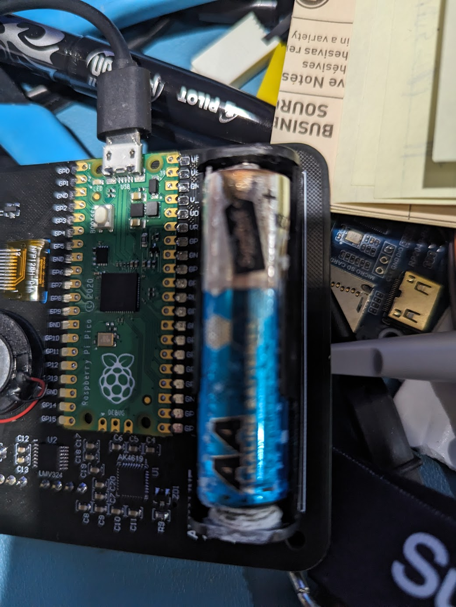{height=500px}

## Powers of Ten

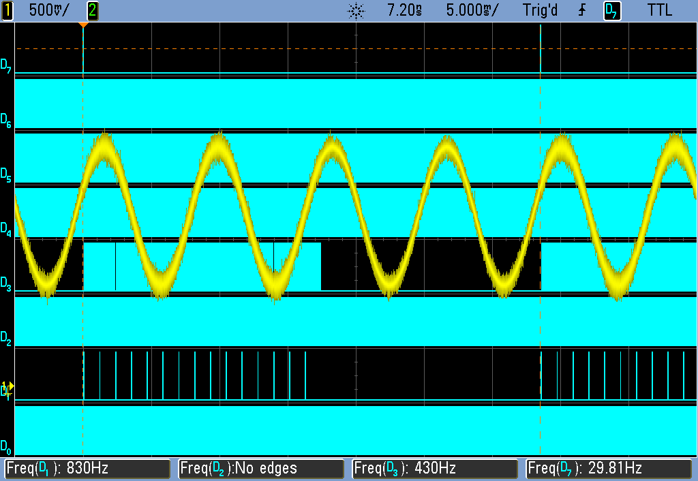{height=500px}

## 10 ms
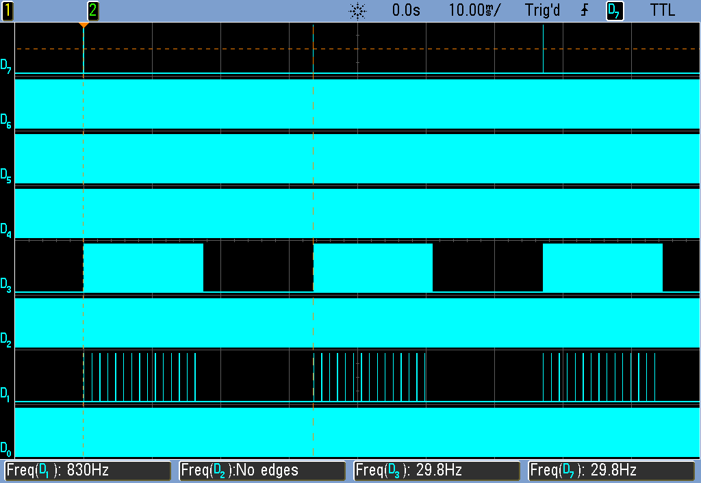{height=500px}

## 1 ms
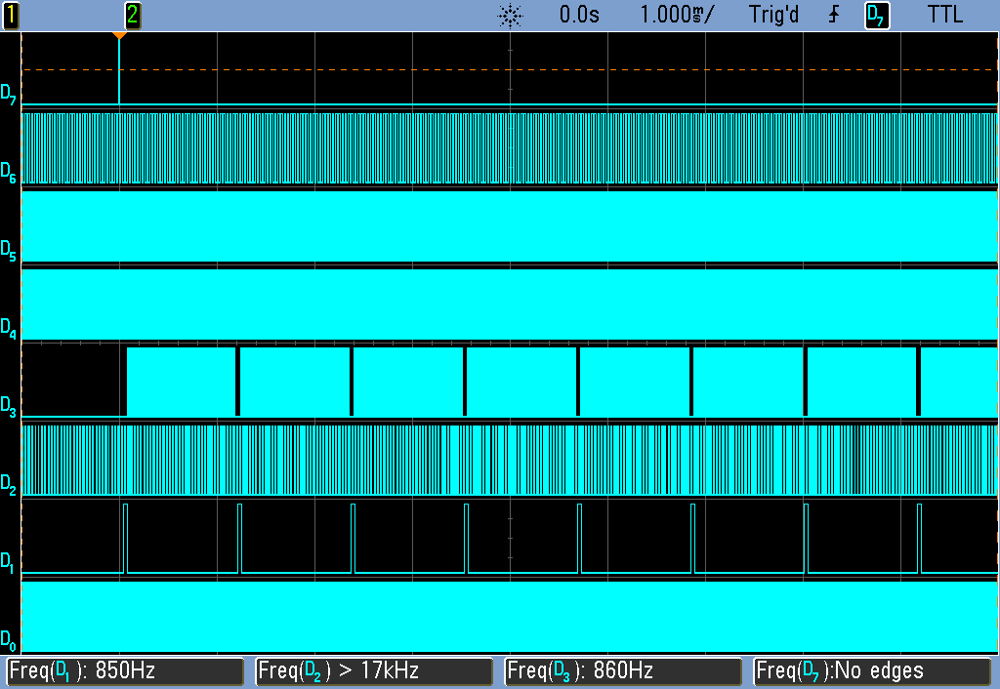{height=500px}

## 100 us
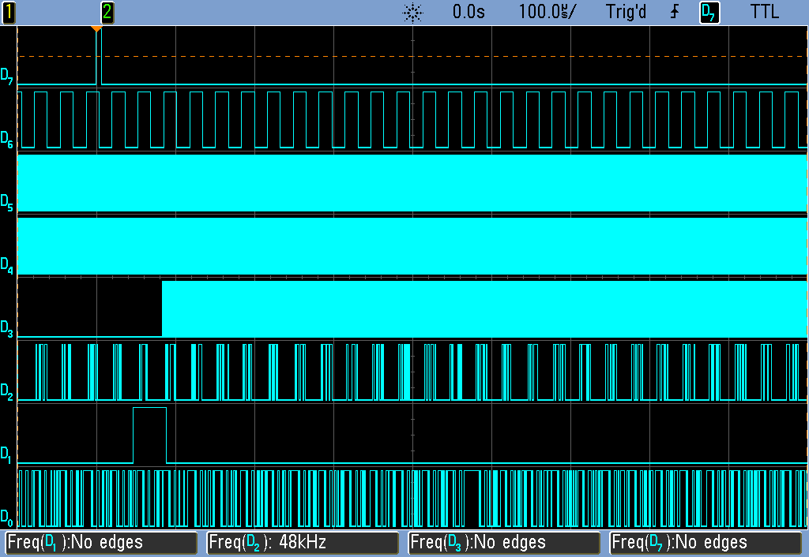{height=500px}

## 10 us
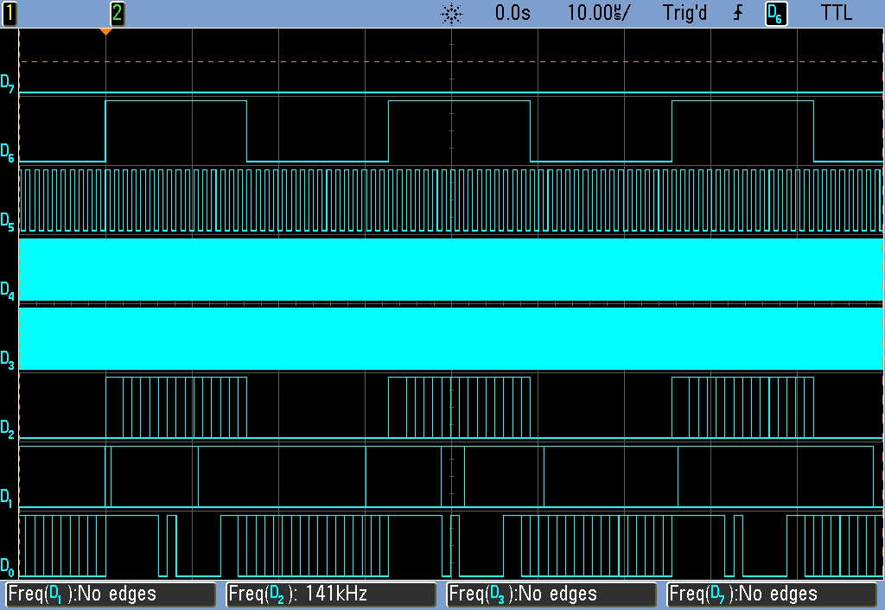{height=500px}

## 1 us
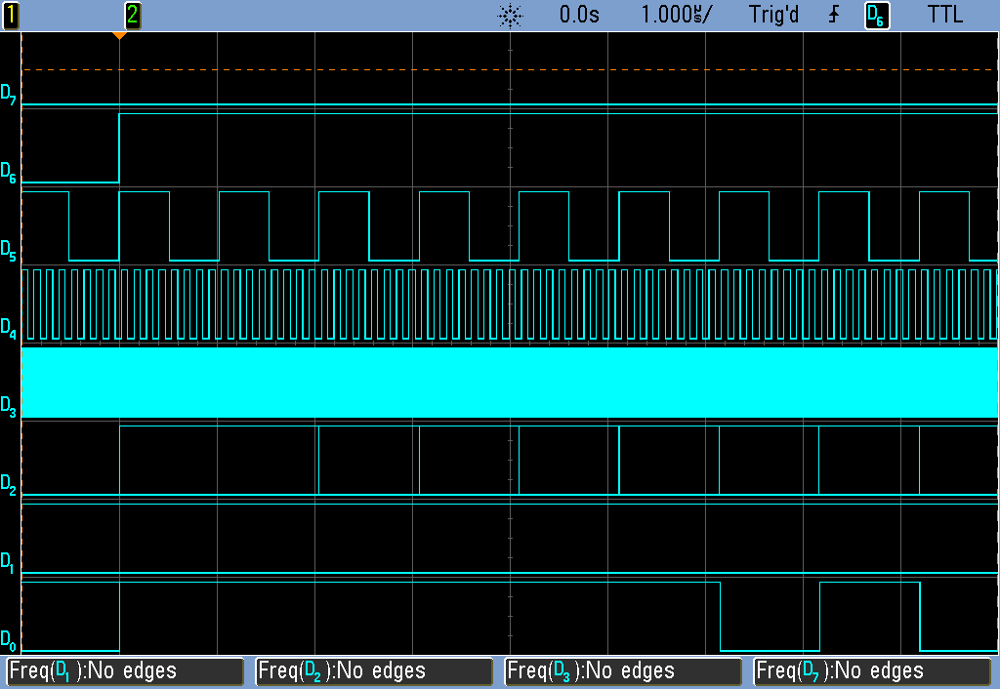{height=500px}

## 100 ns
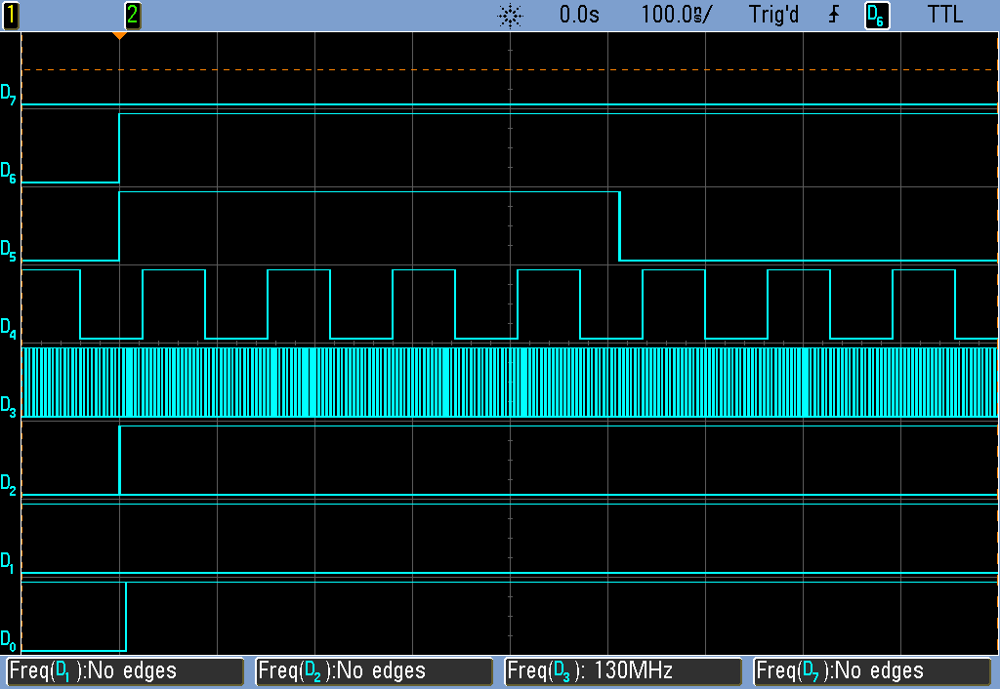{height=500px}

## 10 ns
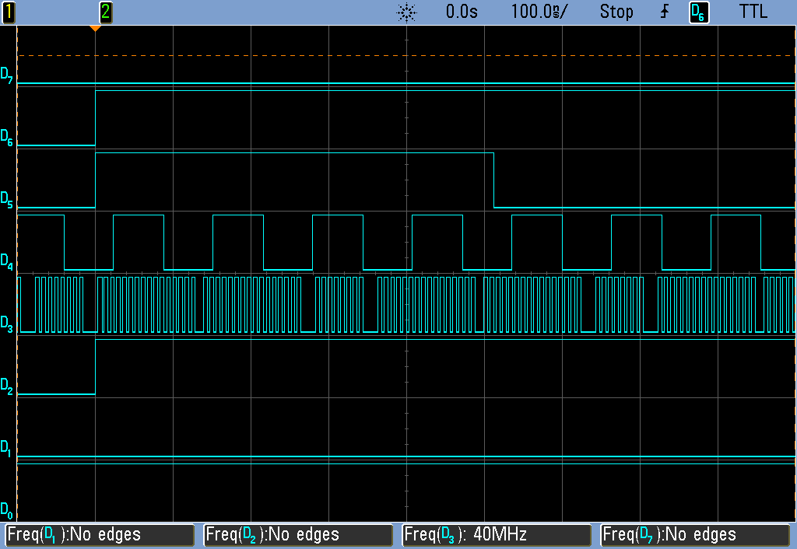{height=500px}

## 1 ns
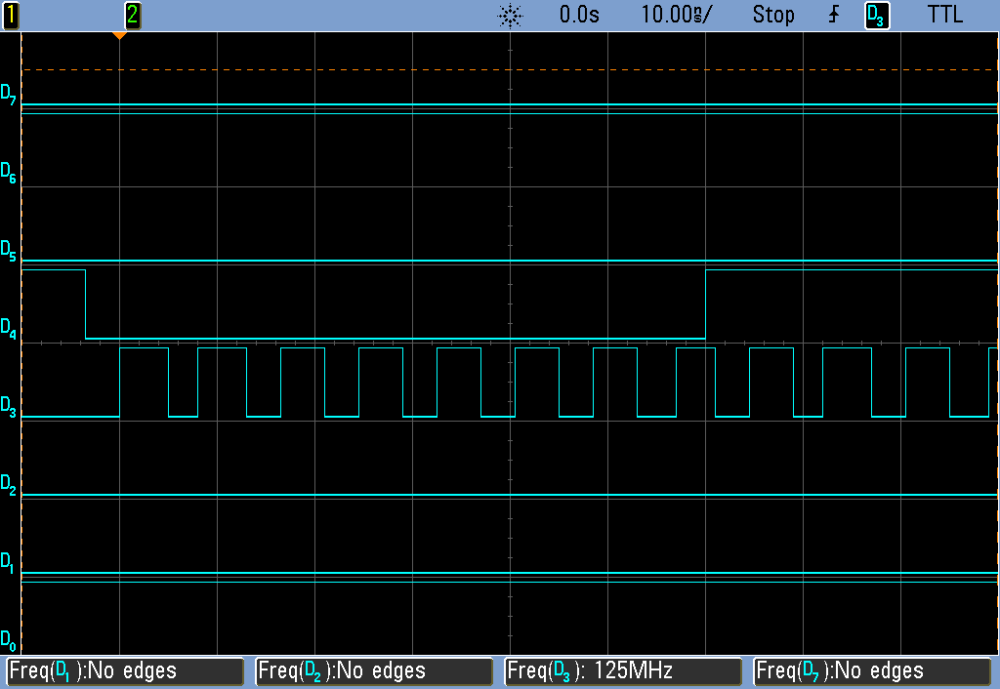{height=500px}

## The DMA/PIO Machine

- DMA reads from one location to another

- DMA and memory is Turing complete

- DMA counter

## Pixel Pusher

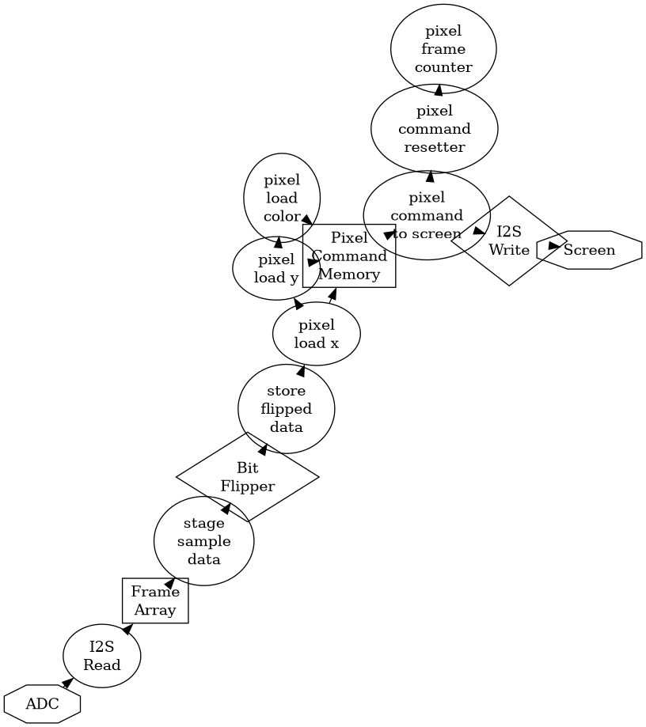{height=500px}

# Badgers!

